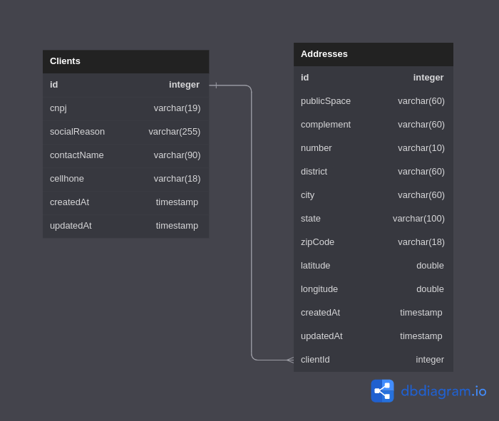

# Teamsoftbr API test

<p align="center">
  <a href="http://nestjs.com/" target="blank"></a>
</p>

## Description

Nestjs API for client and address register.

## How start

```bash
git clone https://github.com/rodsilvavieira2/nest-teamsoft.git

yarn init-app
 #or
npm run init-app
```

## Database Schema



## Technologies used

- [MYSQL](https://www.mysql.com/)
- [Nest.js](https://nestjs.com/)
- [@nestjs/swagger](https://www.npmjs.com/package/@nestjs/swagger)
- [Prisma](https://www.prisma.io/)
- [@googlemaps/google-maps-services-js](https://www.npmjs.com/package/@googlemaps/google-maps-services-js)
